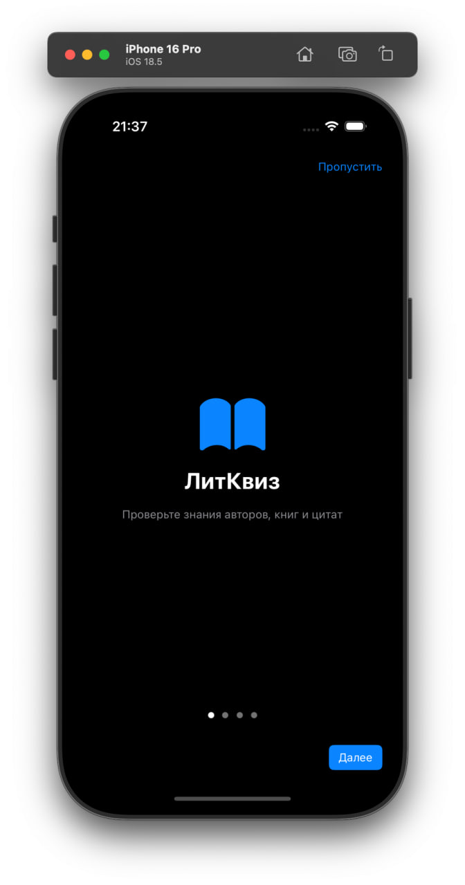
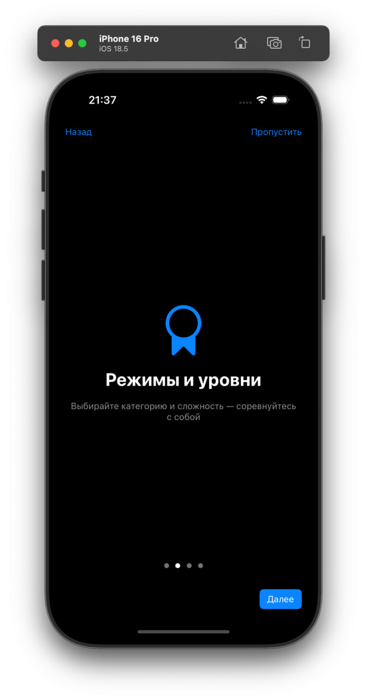
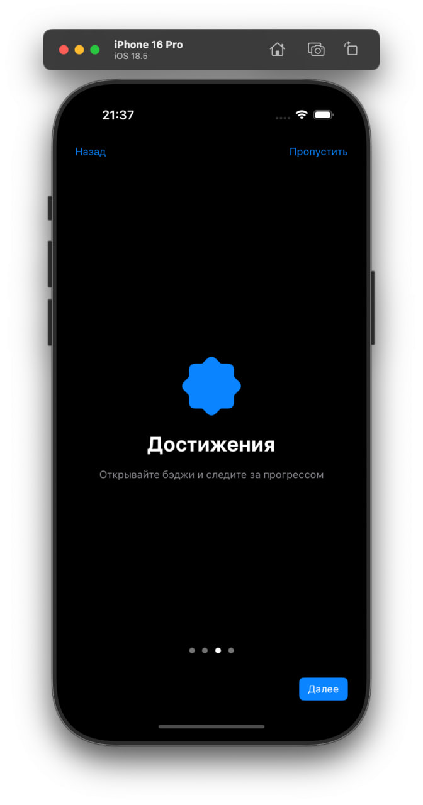
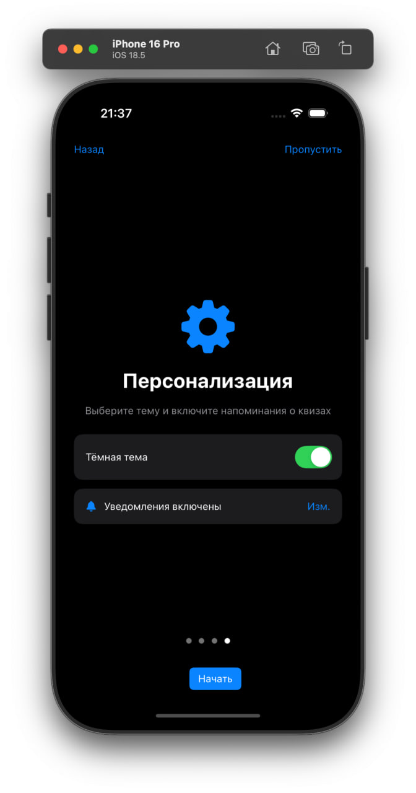
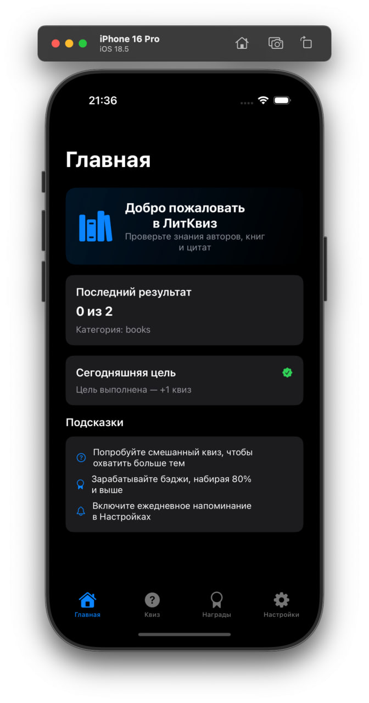
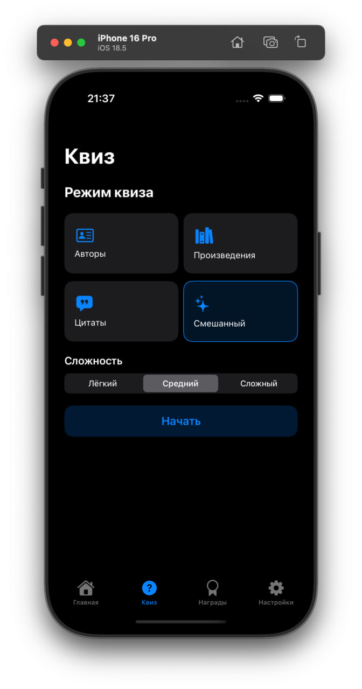
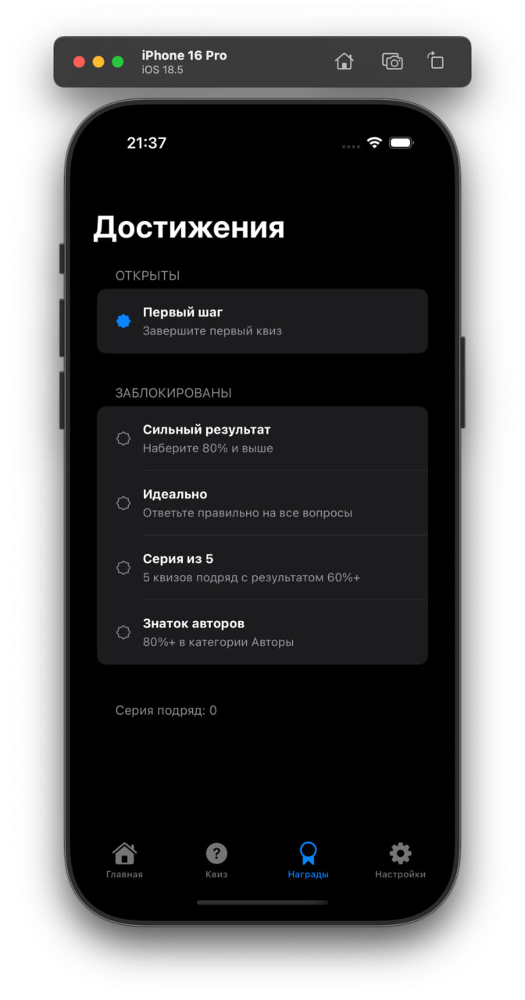
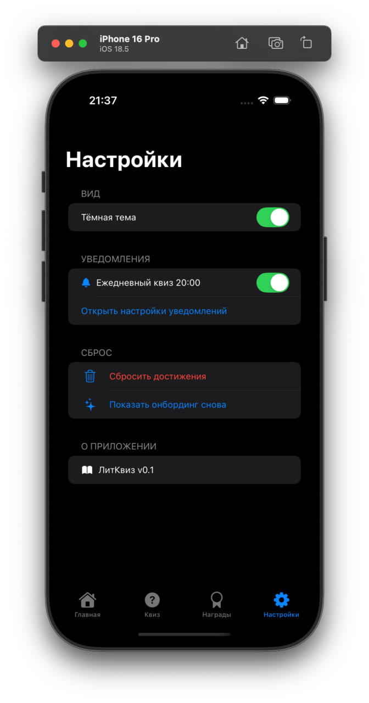

# LearnSwiftCards

📚 Литературный квиз — приложение для проверки знаний о писателях, произведениях и цитатах.
🎯 Проходи викторины, открывай достижения и совершенствуй свои литературные навыки.
⚙️ В настройках можно выбрать тему оформления и отключить уведомления.
✨ Удобный онбординг поможет быстро разобраться с функционалом и начать игру.

## 🛠 Стек
- Swift 5, SwiftUI
- MVVM архитектура
- Чистый код, модульная структура
- Нотификации

## 📸 Скриншоты
<table>
<tr>
<td></td>
<td></td>
<td></td>
<td></td>

<td></td>
<td></td>
<td></td>
<td></td>

</tr>
</table>